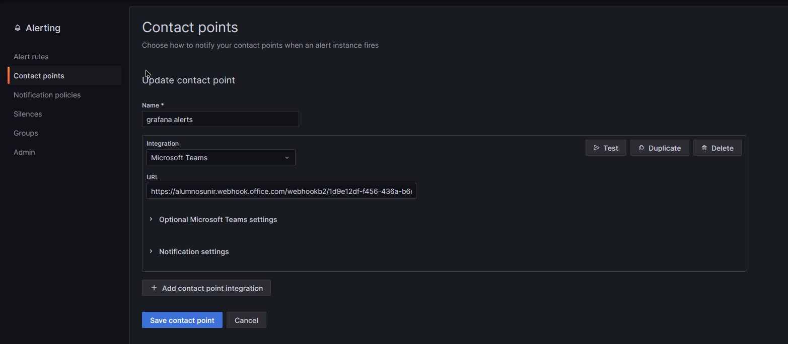

INSTALACIÓN DE GRAFANA EN KUBERNETES 
1. Add the Grafana Helm repository: helm repo add grafana https://grafana.github.io/helm-charts

2. Update the Helm repository: helm repo update

3. Install Grafana using Helm: helm install grafana grafana/grafana

4. Verify that Grafana is running: kubectl port-forward service/grafana 3000:80

Open a web browser and go to http://localhost:3000. You should see the Grafana login page.

AÑADIR EL DATASOURCE DE PROMETHEUS EN GRAFANA 

5. Para conectar la base de datos de prometheus en grafana usaremos esta url de prometheus server http://host.docker.internal:9090

AÑADIR UN WEBHOOK DE MICROSOFT TEAMS PARA EL ENVIO DE LAS ALERTAS EN GRAFANA 

6. seguimos las instrucciones https://learn.umh.app/blog/how-to-install-grafana-alerts-in-microsoft-teams/

